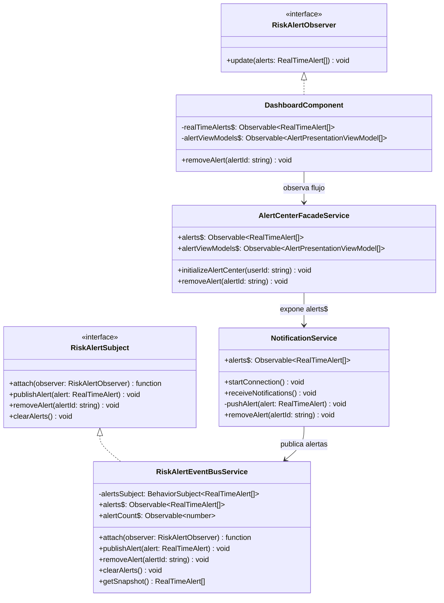
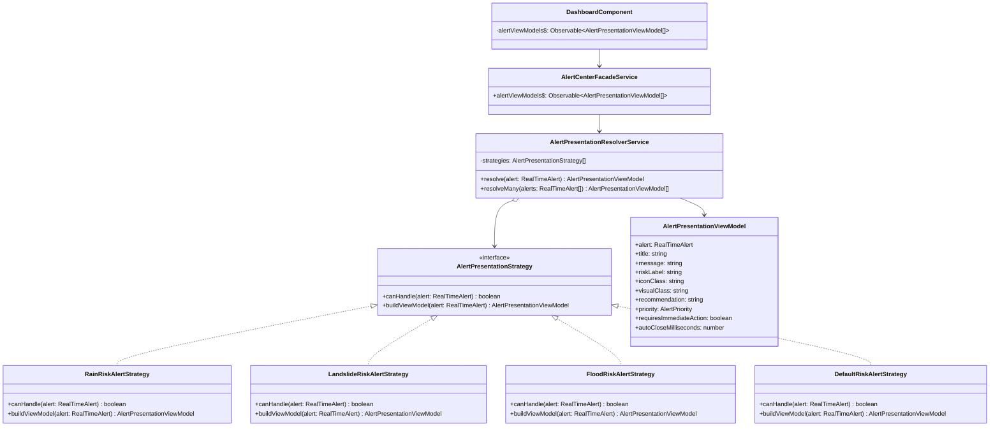

# Patrones de comportamiento aplicados al Reto 1

## Diagnóstico del proyecto actual

El proyecto ya tenía una base clara con patrones creacionales y estructurales:

- **Factory Method**: creación de canales de notificación (`SMSChannelCreator`, `EmailChannelCreator`, `PushChannelCreator`, `WhatsAppChannelCreator`).
- **Facade**: `AlertCenterFacadeService` simplifica la comunicación entre el dashboard y los servicios internos.
- **Decorator**: `AlertMessageBuilderService` enriquece mensajes con nivel de riesgo, ubicación, recomendación, prioridad, fecha y lenguaje claro.

El problema pendiente no era crear objetos ni envolver subsistemas, sino **coordinar comportamientos** cuando llega una alerta y **adaptar la comunicación al tipo de riesgo**.

Por eso se implementaron dos patrones de comportamiento:

1. **Observer** para distribuir alertas en tiempo real a los componentes interesados.
2. **Strategy** para cambiar la forma de presentar la alerta según el riesgo detectado.

El patrón con mayor aplicación en el contexto general del reto es **Observer**, porque el núcleo del sistema es recibir alertas en tiempo real tipo SIATA y propagarlas oportunamente a diferentes partes de la interfaz sin acoplarlas entre sí.

---

## Parte A. Justificación de patrones de comportamiento

### Problema 1: las alertas llegan en tiempo real y varios componentes deben enterarse sin acoplamiento directo

**Situación en el reto:**
SIATA o el backend puede emitir una alerta por lluvia, inundación o deslizamiento. Esa alerta debe verse en el listado, actualizar el contador de la campana, activar avisos visuales y permitir descartarla. Si cada componente consultara directamente a SignalR o al `NotificationService`, el sistema quedaría acoplado y difícil de extender.

**Patrón aplicado:** Observer.

**Clases implementadas:**

- `RiskAlertSubject`
- `RiskAlertObserver`
- `RiskAlertEventBusService`

**Justificación:**
`RiskAlertEventBusService` actúa como sujeto concreto. Mantiene un `BehaviorSubject<RealTimeAlert[]>` y expone `alerts$` y `alertCount$`. Los componentes Angular consumen esos flujos con `async pipe` o suscripción, por lo que quedan desacoplados de SignalR y del origen real de la alerta.

**Cómo mejora la comunicación:**

- `NotificationService` solo publica alertas.
- `AlertCenterFacadeService` solo expone el flujo al frontend.
- `DashboardComponent` solo observa cambios.
- Si luego se agrega un componente de mapa, modal de emergencia o historial, no se modifica el emisor; solo se suscribe al flujo.

**Principios SOLID reforzados:**

- **SRP:** el bus de alertas se encarga de publicar y notificar; SignalR queda en `NotificationService`.
- **OCP:** se pueden agregar nuevos observadores sin modificar el publicador.
- **DIP:** los componentes dependen de un flujo observable, no de detalles de conexión.

---

### Problema 2: no todas las alertas deben comunicarse igual al ciudadano

**Situación en el reto:**
Una alerta de deslizamiento no debería verse igual que una lluvia moderada o una creciente súbita. Para que el usuario comprenda y atienda oportunamente, la interfaz debe adaptar título, color, icono, prioridad, recomendación y tiempo visible de la alerta.

**Patrón aplicado:** Strategy.

**Clases implementadas:**

- `AlertPresentationStrategy`
- `AlertPresentationResolverService`
- `RainRiskAlertStrategy`
- `LandslideRiskAlertStrategy`
- `FloodRiskAlertStrategy`
- `DefaultRiskAlertStrategy`
- `AlertPresentationViewModel`

**Justificación:**
Cada estrategia sabe cómo presentar un tipo de alerta. El componente no usa condicionales grandes para decidir si una alerta es de lluvia, deslizamiento o inundación. El resolvedor selecciona la estrategia adecuada y devuelve un `AlertPresentationViewModel` listo para pintar.

**Cómo mejora la comunicación:**

- Las reglas de comprensión ciudadana quedan fuera del HTML y del componente.
- El dashboard recibe un modelo claro: título, etiqueta de riesgo, icono, recomendación y prioridad.
- Para agregar un nuevo riesgo, por ejemplo “vendaval” o “calidad del aire”, se crea una nueva estrategia sin alterar las existentes.

**Principios SOLID reforzados:**

- **SRP:** cada estrategia maneja un solo tipo de riesgo.
- **OCP:** se agregan nuevas estrategias sin modificar las anteriores.
- **LSP:** todas las estrategias pueden reemplazarse mediante la interfaz común.
- **ISP:** la interfaz solo exige `canHandle` y `buildViewModel`.
- **DIP:** el facade y el dashboard dependen de la abstracción de presentación, no de condicionales concretos.

---

## Comparación: patrón con mayor aplicación

| Patrón | Aplicación en el reto | Alcance |
|---|---|---|
| Observer | Muy alta: permite recibir y propagar alertas en tiempo real a toda la interfaz | Comunicación de eventos |
| Strategy | Alta: mejora la comprensión de las alertas según tipo de riesgo | Presentación y respuesta visual |

**Conclusión:** el más aplicable es **Observer**, porque el problema central del reto es que las personas no reciben oportunamente las alertas. Strategy complementa el objetivo al hacer que la alerta recibida sea más clara y accionable.

---

## Parte B. Diagramas UML de clases

### Diagrama 1: Observer aplicado a alertas en tiempo real



### Diagrama 2: Strategy aplicado a la presentación de alertas



---

## Parte C. Implementación realizada

### Archivos nuevos del patrón Observer

```text
src/services/behavioral/observer/
  risk-alert-observer.interface.ts
  risk-alert-subject.interface.ts
  risk-alert-event-bus.service.ts
```

### Archivos nuevos del patrón Strategy

```text
src/services/behavioral/strategy/
  alert-presentation-strategy.interface.ts
  alert-presentation-resolver.service.ts
  rain-risk-alert.strategy.ts
  landslide-risk-alert.strategy.ts
  flood-risk-alert.strategy.ts
  default-risk-alert.strategy.ts
  alert-keywords.util.ts
```

### Archivos integrados/modificados

```text
src/services/notification.service.ts
src/services/facade/alert-center.facade.ts
src/components/dashboard.component.ts
src/components/dashboard.component.html
src/components/dashboard.component.css
```

### Flujo final

```text
SignalR / simulacion
      ↓
NotificationService
      ↓ publica alerta
RiskAlertEventBusService  ← Observer
      ↓ alerts$
AlertCenterFacadeService
      ↓ alertViewModels$ usando Strategy
DashboardComponent
      ↓
Interfaz con color, icono, etiqueta, recomendacion y prioridad
```
