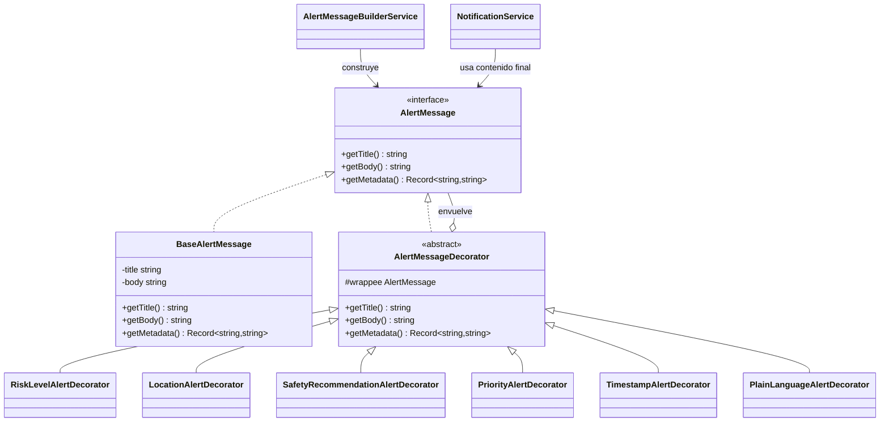

# Prompt para GitHub Copilot - Implementar patrón estructural Decorator en Alerta Valle

## Contexto del proyecto

Estoy trabajando en el repositorio:

`https://github.com/EdiRestrepo/risk-event-notification-fronted/tree/master/RiskEventNotifacionFrontend`

El proyecto es un frontend Angular para una plataforma llamada **Alerta Valle**, orientada a notificar a personas de Medellín y el Valle de Aburrá sobre lluvias intensas, inundaciones, crecientes súbitas y deslizamientos.

En la primera entrega ya se implementó el patrón creacional **Factory Method** para crear canales de notificación como App, SMS, Correo Electrónico y WhatsApp. Ahora necesito implementar una nueva funcionalidad usando un patrón estructural diferente.

## Patrón estructural a implementar

Implementa el patrón **Decorator**.

## Funcionalidad nueva

Crear una funcionalidad llamada **Enriquecimiento progresivo de mensajes de alerta**.

La idea es que antes de enviar una alerta por los canales activos, el sistema pueda tomar un mensaje base y agregarle información adicional de forma flexible, sin modificar la clase base ni los canales de notificación existentes.

Los mensajes de alerta deben poder enriquecerse con:

- Nivel de riesgo.
- Municipio o zona afectada.
- Recomendaciones de seguridad.
- Etiqueta de prioridad.
- Fecha y hora de emisión.
- Versión de lenguaje claro para que el usuario entienda mejor la alerta.

Ejemplo de mensaje final:

```text
[ALERTA NARANJA] Lluvias intensas en el Valle de Aburrá.
Zona afectada: Medellín, Bello y Envigado.
Recomendación: Evite transitar cerca de quebradas y zonas de ladera.
Prioridad: Alta.
Emitido: 23 may, 09:25.
```

## Objetivo técnico

Implementar el patrón Decorator para construir mensajes de alerta de forma dinámica antes de enviarlos mediante `NotificationService`.

No se deben modificar directamente las clases de canales existentes (`SMSChannel`, `EmailChannel`, `PushChannel`, `WhatsAppChannel`) ni el Factory Method. El Decorator debe trabajar sobre el contenido del mensaje, no sobre la creación de los canales.

## Estructura sugerida

Crear una carpeta:

```text
src/services/decorator/
```

Archivos sugeridos:

```text
src/services/decorator/alert-message.interface.ts
src/services/decorator/base-alert-message.ts
src/services/decorator/alert-message.decorator.ts
src/services/decorator/risk-level-alert.decorator.ts
src/services/decorator/location-alert.decorator.ts
src/services/decorator/safety-recommendation-alert.decorator.ts
src/services/decorator/priority-alert.decorator.ts
src/services/decorator/timestamp-alert.decorator.ts
src/services/decorator/plain-language-alert.decorator.ts
src/services/decorator/alert-message-builder.service.ts
```

## Clases e interfaces esperadas

### 1. `AlertMessage`

Componente base del patrón.

```ts
export interface AlertMessage {
  getTitle(): string;
  getBody(): string;
  getMetadata(): Record<string, string>;
}
```

### 2. `BaseAlertMessage`

Componente concreto.

```ts
export class BaseAlertMessage implements AlertMessage {
  constructor(
    private title: string,
    private body: string
  ) {}

  getTitle(): string {
    return this.title;
  }

  getBody(): string {
    return this.body;
  }

  getMetadata(): Record<string, string> {
    return {};
  }
}
```

### 3. `AlertMessageDecorator`

Decorator abstracto.

```ts
export abstract class AlertMessageDecorator implements AlertMessage {
  constructor(protected wrappee: AlertMessage) {}

  getTitle(): string {
    return this.wrappee.getTitle();
  }

  getBody(): string {
    return this.wrappee.getBody();
  }

  getMetadata(): Record<string, string> {
    return this.wrappee.getMetadata();
  }
}
```

### 4. Decoradores concretos

Crear decoradores concretos como:

```ts
export class RiskLevelAlertDecorator extends AlertMessageDecorator {}
export class LocationAlertDecorator extends AlertMessageDecorator {}
export class SafetyRecommendationAlertDecorator extends AlertMessageDecorator {}
export class PriorityAlertDecorator extends AlertMessageDecorator {}
export class TimestampAlertDecorator extends AlertMessageDecorator {}
export class PlainLanguageAlertDecorator extends AlertMessageDecorator {}
```

Cada decorador debe agregar información al título, cuerpo o metadata, sin romper el contrato `AlertMessage`.

### 5. `AlertMessageBuilderService`

Crear un servicio Angular que facilite construir mensajes decorados:

```ts
@Injectable({ providedIn: 'root' })
export class AlertMessageBuilderService {
  buildCriticalRainAlert(): AlertMessage {
    let message: AlertMessage = new BaseAlertMessage(
      'Lluvias intensas',
      'Se prevén lluvias intensas durante las próximas horas en el Valle de Aburrá.'
    );

    message = new RiskLevelAlertDecorator(message, 'NARANJA');
    message = new LocationAlertDecorator(message, ['Medellín', 'Bello', 'Envigado']);
    message = new SafetyRecommendationAlertDecorator(message, 'Evite transitar cerca de quebradas y zonas de ladera.');
    message = new PriorityAlertDecorator(message, 'Alta');
    message = new TimestampAlertDecorator(message, new Date());
    message = new PlainLanguageAlertDecorator(message);

    return message;
  }
}
```

## Integración con el sistema actual

Modificar `NotificationService` o el flujo de envío de prueba para que pueda recibir el mensaje decorado y enviarlo por los canales activos.

Ejemplo:

```ts
const decoratedMessage = this.alertMessageBuilder.buildCriticalRainAlert();

this.notificationService.sendNotification({
  title: decoratedMessage.getTitle(),
  message: decoratedMessage.getBody(),
  recipient: 'usuario-demo',
  channels: activeChannels
});
```

## Requisitos importantes

1. Mantener intacto el patrón **Factory Method** existente para crear los canales.
2. El Decorator debe complementar el Factory Method, no reemplazarlo.
3. No crear condicionales largos para armar el mensaje.
4. Cada decorador debe tener una responsabilidad clara.
5. Aplicar principios SOLID:
   - **SRP:** cada decorador agrega solo un tipo de información.
   - **OCP:** se pueden crear nuevos decoradores sin modificar los existentes.
   - **LSP:** cualquier decorador debe poder usarse como `AlertMessage`.
   - **DIP:** el envío debe depender de la abstracción `AlertMessage`, no de clases concretas.
6. Mantener la aplicación funcional con `npm start` y `npm run build`.


## Entregables esperados

1. Código Angular funcional.
2. Nueva carpeta `src/services/decorator/` con las clases del patrón.
3. Integración del mensaje decorado con el flujo de envío de notificaciones.
4. Actualización del `FRONTEND_GUIDE.md` o `README.md` documentando:
   - Funcionalidad implementada.
   - Patrón Decorator.
   - Justificación.
   - Correspondencia con el patrón.
5. Diagrama UML en Mermaid o PlantUML dentro de la documentación.

## Diagrama UML sugerido en Mermaid

Agregar o adaptar este diagrama en la documentación:



## Justificación que debe quedar en la documentación

El patrón **Decorator** es adecuado porque la plataforma necesita enriquecer los mensajes de alerta con información adicional sin modificar las clases base ni los canales de notificación. En un sistema de alertas, el contenido puede variar según el nivel de riesgo, ubicación, hora, prioridad y recomendaciones. Usar decoradores permite agregar esas responsabilidades de manera flexible y combinable. Así, una alerta puede tener solo nivel de riesgo, o también ubicación, recomendación y prioridad, sin crear múltiples subclases para cada combinación posible.

