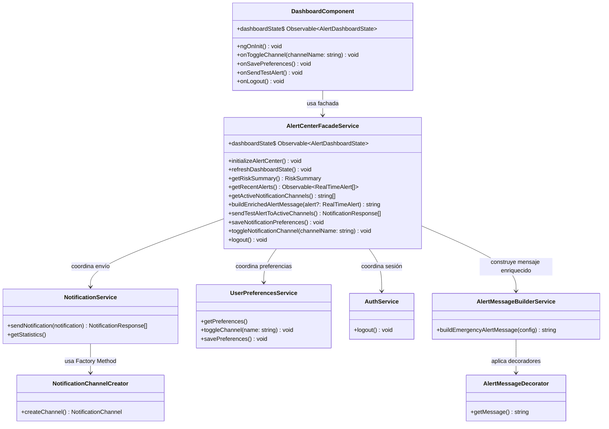

# Prompt para GitHub Copilot - Implementar patrón estructural Facade integrando Factory Method y Decorator en Alerta Valle

## Contexto del proyecto

Estoy trabajando en el repositorio:

`https://github.com/EdiRestrepo/risk-event-notification-fronted/tree/master/RiskEventNotifacionFrontend`

El proyecto es un frontend Angular llamado **Alerta Valle**, cuyo objetivo es notificar a personas de Medellín y el Valle de Aburrá sobre eventos de riesgo como lluvias intensas, inundaciones y deslizamientos.

El reto académico pide implementar patrones de diseño sobre una arquitectura moderna en Angular. Ya se implementaron los siguientes patrones:

1. **Factory Method** para la selección y creación de canales de notificación:
   - App Alerta Valle
   - SMS
   - Correo Electrónico
   - WhatsApp

2. **Decorator** para enriquecer mensajes de alerta antes de enviarlos.

Ahora necesito implementar el patrón estructural **Facade**, pero debe integrarse con lo que ya existe, especialmente con el patrón **Decorator** ya implementado.

---

## Estado actual del proyecto

La estructura actual relevante es similar a esta:

```text
src/
  app/
    components/
      dashboard.component.ts
      dashboard.component.html
      dashboard.component.css
      login.component.ts
      login.component.html
      login.component.css
    services/
      decorator/
        alert-message-builder.service.ts
        alert-message.decorator.ts
        alert-message.interface.ts
        base-alert-message.ts
        examples.ts
        index.ts
        location-alert.decorator.ts
        plain-language-alert.decorator.ts
        priority-alert.decorator.ts
        README.md
        risk-level-alert.decorator.ts
        safety-recommendation-alert.decorator.ts
        timestamp-alert.decorator.ts
      factory-method/
        channels/
        creators/
        notification-channel-creator.ts
        notification-channel.interface.ts
      auth.service.ts
      notification.service.ts
      user-preferences.service.ts
```

IMPORTANTE: antes de escribir código, revisa los archivos existentes para respetar nombres reales de clases, interfaces, métodos y rutas. Si algún nombre propuesto en este prompt no coincide con el proyecto, adapta la implementación al código real sin romper lo existente.

---

## Patrón estructural a implementar

Implementa el patrón **Facade**.

La fachada debe ser una capa de coordinación que simplifique el uso del dashboard y oculte la complejidad de los servicios existentes.

No debe reemplazar ni duplicar:

- Factory Method
- Decorator
- NotificationService
- UserPreferencesService
- AuthService

Debe integrarlos.

---

## Funcionalidad nueva

Crear una funcionalidad llamada:

# Centro Unificado de Alertas

El objetivo es que `DashboardComponent` no tenga que conocer directamente cómo se consultan alertas, cómo se obtienen preferencias, cómo se enriquecen mensajes ni cómo se envían notificaciones por canales activos.

El dashboard debe consumir una única fachada, por ejemplo:

```ts
AlertCenterFacadeService
```

Esta fachada debe coordinar internamente:

- Estado consolidado del dashboard.
- Alertas recientes.
- Nivel de riesgo actual.
- Municipios afectados.
- Probabilidad de lluvia.
- Última actualización.
- Preferencias activas de canales de notificación.
- Construcción/enriquecimiento del mensaje usando el patrón Decorator ya implementado.
- Envío de notificaciones usando el flujo existente basado en Factory Method.
- Guardado de preferencias.
- Cierre de sesión.

---

## Objetivo técnico principal

Crear una fachada Angular que actúe como punto único de acceso para el dashboard.

`DashboardComponent` debe quedar más limpio y depender principalmente de:

```ts
AlertCenterFacadeService
```

En lugar de coordinar directamente múltiples servicios.

La fachada debe exponer un estado observable para la vista, por ejemplo:

```ts
readonly dashboardState$: Observable<AlertDashboardState>;
```

---

## Estructura sugerida

Crear una nueva carpeta:

```text
src/app/services/facade/
```

Archivos sugeridos:

```text
src/app/services/facade/alert-center.facade.ts
src/app/services/facade/alert-dashboard-state.model.ts
src/app/services/facade/risk-summary.model.ts
src/app/services/facade/index.ts
src/app/services/facade/README.md
```

Si el proyecto usa una convención diferente de rutas o nombres, ajusta la ubicación respetando la estructura real.

---

## Modelos esperados

### 1. `RiskSummary`

Modelo para representar el resumen de riesgo mostrado en las tarjetas del dashboard.

```ts
export type RiskLevel = 'BAJO' | 'MEDIO' | 'NARANJA' | 'ROJO';

export interface RiskSummary {
  riskLevel: RiskLevel;
  affectedMunicipalities: number;
  rainProbability: number;
  lastUpdate: Date;
}
```

---

### 2. `AlertDashboardState`

Modelo para representar el estado consolidado de la pantalla principal.

Adapta los tipos `RealTimeAlert`, `NotificationResponse`, `NotificationPreference` o equivalentes a los nombres reales del proyecto.

```ts
export interface AlertDashboardState {
  summary: RiskSummary;
  recentAlerts: RealTimeAlert[];
  activeChannels: string[];
  userName: string;
  enrichedPreviewMessage: string;
  isLoading: boolean;
  errorMessage?: string;
}
```

---

## Servicio principal del patrón Facade

Crear el servicio:

```ts
@Injectable({ providedIn: 'root' })
export class AlertCenterFacadeService {
  readonly dashboardState$: Observable<AlertDashboardState>;

  initializeAlertCenter(): void;
  refreshDashboardState(): void;
  getRiskSummary(): RiskSummary;
  getRecentAlerts(): Observable<RealTimeAlert[]>;
  getActiveNotificationChannels(): string[];
  buildEnrichedAlertMessage(alert?: RealTimeAlert): string;
  sendTestAlertToActiveChannels(): NotificationResponse[];
  saveNotificationPreferences(): void;
  toggleNotificationChannel(channelName: string): void;
  logout(): void;
}
```

Ajusta los tipos y métodos si el código existente tiene nombres diferentes.

---

## Integración obligatoria con Decorator

El proyecto ya tiene implementado el patrón Decorator en:

```text
src/app/services/decorator/
```

La fachada debe usarlo. No debe recrearlo.

Debe inyectar y utilizar, si existe, el servicio:

```ts
AlertMessageBuilderService
```

o el equivalente real del proyecto.

La responsabilidad de la fachada será decidir cuándo construir el mensaje enriquecido y entregar ese resultado al flujo de envío.

Ejemplo de intención:

```ts
buildEnrichedAlertMessage(alert?: RealTimeAlert): string {
  return this.alertMessageBuilder.buildMessage({
    riskLevel: 'NARANJA',
    location: 'Valle de Aburrá',
    recommendation: 'Evite transitar cerca de quebradas y zonas de ladera',
    priority: 'Alta',
    timestamp: new Date()
  });
}
```

El código anterior es solo ilustrativo. Implementa según la API real de `alert-message-builder.service.ts` y los decoradores existentes:

- `RiskLevelAlertDecorator`
- `LocationAlertDecorator`
- `SafetyRecommendationAlertDecorator`
- `PriorityAlertDecorator`
- `TimestampAlertDecorator`
- `PlainLanguageAlertDecorator`

Si el builder actual aún no expone un método cómodo para el facade, puedes agregar un método público sin romper lo existente, por ejemplo:

```ts
buildEmergencyAlertMessage(config: AlertMessageBuildConfig): string
```

Mantén el Decorator como responsable de enriquecer el mensaje, no la fachada.

---

## Integración obligatoria con Factory Method

El proyecto ya tiene implementado Factory Method en:

```text
src/app/services/factory-method/
```

La fachada no debe crear canales directamente con `new`.

La fachada debe llamar a los métodos existentes de `NotificationService` o del servicio que ya use los creators del Factory Method.

La responsabilidad de la fachada será:

1. Obtener canales activos desde preferencias.
2. Construir el mensaje enriquecido usando Decorator.
3. Solicitar a `NotificationService` el envío usando el flujo existente de Factory Method.

Ejemplo conceptual:

```ts
sendTestAlertToActiveChannels(): NotificationResponse[] {
  const message = this.buildEnrichedAlertMessage();
  const activeChannels = this.getActiveNotificationChannels();

  return this.notificationService.sendNotification({
    title: 'Alerta Naranja',
    message,
    channels: activeChannels
  });
}
```

Adapta este ejemplo a los métodos reales de `NotificationService`.

---

## Responsabilidades esperadas de cada patrón

### Factory Method

Debe seguir encargado de crear o resolver el canal de notificación correcto.

Ejemplo de responsabilidad:

```text
Crear canal SMS, Email, WhatsApp o App según la selección del usuario.
```

### Decorator

Debe seguir encargado de enriquecer el contenido del mensaje.

Ejemplo de responsabilidad:

```text
Agregar nivel de riesgo, ubicación, prioridad, recomendaciones y fecha al mensaje base.
```

### Facade

Debe encargarse de coordinar el flujo completo desde el punto de vista del dashboard.

Ejemplo de responsabilidad:

```text
Preparar estado del dashboard, obtener canales activos, construir mensaje enriquecido, enviar notificación y guardar preferencias usando una interfaz simple.
```

---

## Refactor requerido en `DashboardComponent`

Modificar `DashboardComponent` para que use la fachada.

El componente no debería inyectar directamente muchos servicios relacionados con alertas, preferencias, autenticación o decoradores, salvo que sea estrictamente necesario.

Ejemplo esperado:

```ts
export class DashboardComponent implements OnInit, OnDestroy {
  dashboardState$ = this.alertCenterFacade.dashboardState$;

  constructor(private readonly alertCenterFacade: AlertCenterFacadeService) {}

  ngOnInit(): void {
    this.alertCenterFacade.initializeAlertCenter();
  }

  onToggleChannel(channelName: string): void {
    this.alertCenterFacade.toggleNotificationChannel(channelName);
  }

  onSavePreferences(): void {
    this.alertCenterFacade.saveNotificationPreferences();
  }

  onSendTestAlert(): void {
    this.alertCenterFacade.sendTestAlertToActiveChannels();
  }

  onLogout(): void {
    this.alertCenterFacade.logout();
  }
}
```

Si el HTML usa propiedades actuales del componente, puedes conservar nombres públicos para evitar cambios grandes, pero internamente deben delegar en la fachada.

---

## Requisitos de implementación

1. Crear `AlertCenterFacadeService` como la clase principal que representa el patrón Facade.
2. Integrar el facade con el Decorator ya implementado mediante `AlertMessageBuilderService` o equivalente.
3. Integrar el facade con el Factory Method indirectamente mediante `NotificationService` o el servicio existente que ya use los creators/canales.
4. No duplicar lógica de envío de notificaciones.
5. No duplicar lógica de construcción de mensajes enriquecidos.
6. No eliminar ni reemplazar la implementación existente de Factory Method.
7. No eliminar ni reemplazar la implementación existente de Decorator.
8. Reducir la lógica de coordinación dentro de `DashboardComponent`.
9. Exponer estado mediante RxJS usando `Observable`, `BehaviorSubject`, `combineLatest`, `map` o equivalentes cuando aplique.
10. Mantener la aplicación compilando correctamente.
11. Agregar comentarios breves solo donde ayuden a evidenciar el patrón, evitando sobrecomentar.

---

## Principios SOLID esperados

### SRP - Single Responsibility Principle

`DashboardComponent` debe enfocarse en la vista.

`AlertCenterFacadeService` debe coordinar el caso de uso del dashboard.

`AlertMessageBuilderService` y los decoradores deben enriquecer mensajes.

`NotificationService` y Factory Method deben enviar por canales.

### OCP - Open/Closed Principle

Si en el futuro se agrega un nuevo canal, debe agregarse al Factory Method sin modificar el dashboard.

Si en el futuro se agrega un nuevo decorador de mensaje, debe agregarse al flujo del builder sin modificar el dashboard.

### DIP - Dependency Inversion Principle

El dashboard debe depender de una abstracción de alto nivel: la fachada.

---

## Entregables esperados

1. Nueva carpeta `src/app/services/facade/`.
2. Servicio `AlertCenterFacadeService` implementado.
3. Modelos del estado del dashboard.
4. Refactor de `DashboardComponent` para usar el facade.
5. Integración real con el Decorator ya existente.
6. Integración real con el Factory Method ya existente.
7. Actualización del `README.md`, `FRONTEND_GUIDE.md` o documentación equivalente.
8. Diagrama UML en Mermaid o PlantUML.
9. Explicación de correspondencia del código con el patrón Facade.
10. Evidencia de que el proyecto compila con:

```bash
npm run build
```

---

## Documentación que debes agregar

Agregar una sección similar a esta en el `README.md`, `FRONTEND_GUIDE.md` o archivo equivalente:

```md
## Patrón estructural Facade - Centro Unificado de Alertas

Se implementó el patrón estructural Facade mediante la clase `AlertCenterFacadeService`.

Esta clase ofrece una interfaz simple para que el `DashboardComponent` pueda consultar el estado del sistema, guardar preferencias, construir mensajes enriquecidos y enviar alertas sin conocer los detalles internos de los servicios involucrados.

La fachada coordina internamente:

- `NotificationService`, que conserva el flujo de envío de notificaciones y el Factory Method para resolver canales.
- `UserPreferencesService`, que administra los canales activos del usuario.
- `AuthService`, que administra el cierre de sesión.
- `AlertMessageBuilderService`, que usa el patrón Decorator para enriquecer los mensajes de alerta.

De esta manera, el componente queda desacoplado de la lógica interna de alertas, preferencias, canales y enriquecimiento de mensajes.
```

---

## Diagrama UML sugerido en Mermaid

Agrega o adapta este diagrama en la documentación con los nombres reales del proyecto.



---

## Criterios de aceptación

La implementación será correcta si cumple lo siguiente:

- `DashboardComponent` queda más limpio y delega la coordinación en `AlertCenterFacadeService`.
- El facade usa el builder/decoradores existentes para construir el mensaje enriquecido.
- El facade usa el servicio existente de notificaciones para enviar por canales activos.
- El Factory Method sigue siendo responsable de la creación de canales.
- El Decorator sigue siendo responsable del enriquecimiento del mensaje.
- El Facade se evidencia como punto único de acceso para el dashboard.
- La documentación explica claramente por qué se usa Facade.
- Existe un diagrama UML con clases del dominio, no nombres genéricos.
- La aplicación compila sin errores.

---

## Justificación técnica que debe quedar reflejada

El patrón **Facade** es adecuado porque el dashboard necesita coordinar varias operaciones del sistema: consulta de alertas, resumen de riesgo, preferencias, sesión, construcción de mensajes enriquecidos y envío multicanal. Sin una fachada, el componente tendría que conocer y coordinar directamente varios servicios y patrones internos.

Con `AlertCenterFacadeService`, el dashboard consume una interfaz simple y estable. La fachada no reemplaza los patrones existentes; los integra. Factory Method sigue resolviendo los canales de notificación y Decorator sigue enriqueciendo el mensaje de alerta. Facade se encarga de orquestar el caso de uso completo desde una única entrada para la vista.

Esto reduce el acoplamiento, mejora la mantenibilidad y permite que el componente Angular se concentre en renderizar la interfaz.
