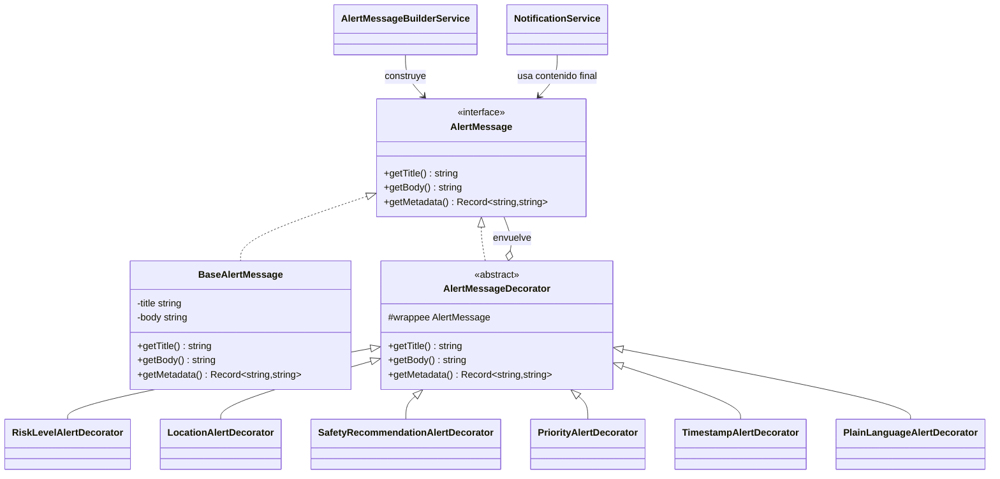

# Alerta Valle - Frontend de Sistema de Alertas Tempranas

## 📋 Descripción

Plataforma de notificación de riesgos para Medellín y el Valle de Aburrá. Permite a los usuarios mantenerse informados sobre inundaciones, deslizamientos y eventos de riesgo en tiempo real.

## 🎯 Características Principales

- ✅ **Login sencillo** con usuario y contraseña
- 📊 **Dashboard interactivo** con mapa de riesgos, alertas y estadísticas
- 🔔 **Múltiples canales de notificación** (SMS, Email, Push, WhatsApp)
- 🏭 **Patrón Factory Method** implementado para creación de canales
- 🎨 **Patrón Decorator** implementado para enriquecimiento de mensajes de alerta
- 🎨 **Diseño responsivo** con Bootstrap 5
- 🌙 **Interfaz moderna** y profesional

## 🏗️ Estructura del Proyecto

```
src/
├── app/
│   ├── app.ts                  # Componente raíz
│   ├── app.routes.ts           # Rutas de la aplicación
│   ├── app.config.ts           # Configuración de la app
│   └── app.html                # Template del componente raíz
├── components/
│   ├── login.component.ts      # Componente de login
│   ├── login.component.html    # Template del login
│   ├── login.component.css     # Estilos del login
│   ├── dashboard.component.ts  # Componente del dashboard
│   ├── dashboard.component.html# Template del dashboard
│   └── dashboard.component.css # Estilos del dashboard
├── services/
│   ├── auth.service.ts                      # Servicio de autenticación
│   ├── notification.service.ts              # Servicio de notificaciones (SignalR)
│   ├── user-preferences.service.ts          # Servicio de preferencias
│   ├── factory-method/                      # Patrón Factory Method (GoF)
│   │   ├── notification-channel.interface.ts # Product (interfaz)
│   │   ├── notification-channel-creator.ts   # Creator (clase abstracta)
│   │   ├── channels/                         # ConcreteProducts
│   │   │   ├── sms-channel.ts
│   │   │   ├── email-channel.ts
│   │   │   ├── push-channel.ts
│   │   │   └── whatsapp-channel.ts
│   │   └── creators/                         # ConcreteCreators
│   │       ├── sms-channel-creator.ts
│   │       ├── email-channel-creator.ts
│   │       ├── push-channel-creator.ts
│   │       └── whatsapp-channel-creator.ts
│   └── decorator/                            # Patrón Decorator (GoF) - NUEVO
│       ├── alert-message.interface.ts        # Component (interfaz)
│       ├── base-alert-message.ts             # ConcreteComponent
│       ├── alert-message.decorator.ts        # Decorator (clase abstracta)
│       ├── risk-level-alert.decorator.ts     # ConcreteDecorator
│       ├── location-alert.decorator.ts       # ConcreteDecorator
│       ├── safety-recommendation-alert.decorator.ts # ConcreteDecorator
│       ├── priority-alert.decorator.ts       # ConcreteDecorator
│       ├── timestamp-alert.decorator.ts      # ConcreteDecorator
│       ├── plain-language-alert.decorator.ts # ConcreteDecorator
│       ├── alert-message-builder.service.ts  # Builder Service
│       └── alert-message-builder.service.spec.ts # Unit Tests
└── styles.css                  # Estilos globales
```

## 🏭 Patrón Factory Method

### Descripción

El patrón **Factory Method** se implementa siguiendo la estructura GoF (Gang of Four) completa para crear canales de notificación según las preferencias del usuario. La implementación incluye la jerarquía Creator → ConcreteCreators, donde cada ConcreteCreator sobreescribe el factory method para instanciar su producto concreto.

**Elementos del patrón (GoF):**
- **Product (Interface)**: `NotificationChannel` — define el contrato que todos los canales deben cumplir (`name`, `send()`, `isActive()`)
- **ConcreteProducts**: `SMSChannel`, `EmailChannel`, `PushChannel`, `WhatsAppChannel` — implementaciones concretas del Product
- **Creator (Abstract)**: `NotificationChannelCreator` — declara el factory method abstracto `createChannel()` y una operación `sendNotification()` que lo utiliza
- **ConcreteCreators**: `SMSChannelCreator`, `EmailChannelCreator`, `PushChannelCreator`, `WhatsAppChannelCreator` — cada uno sobreescribe `createChannel()` para retornar su ConcreteProduct

**Cumplimiento SOLID:**
- **SRP**: Cada clase tiene una única responsabilidad (enviar por su canal específico)
- **OCP**: Se pueden agregar nuevos canales creando un nuevo ConcreteCreator y ConcreteProduct sin modificar las clases existentes
- **LSP**: Todos los canales son sustituibles a través de la interfaz `NotificationChannel`
- **ISP**: La interfaz `NotificationChannel` es pequeña y cohesiva (solo `name`, `send()`, `isActive()`)
- **DIP**: Los servicios dependen de la abstracción `NotificationChannelCreator` y `NotificationChannel`, no de las clases concretas

**Canales disponibles:**
- **SMS Channel**: Envía notificaciones via SMS
- **Email Channel**: Envía notificaciones via correo electrónico
- **Push Channel**: Envía notificaciones push en la app
- **WhatsApp Channel**: Envía notificaciones via WhatsApp

### Diagrama UML (GoF Factory Method)

```
  ┌───────────────────────────────────────────┐       ┌─────────────────────────────────┐
  │  <<abstract>>                             │       │  <<interface>>                  │
  │  NotificationChannelCreator               │       │  NotificationChannel            │
  │  (Creator)                                │       │  (Product)                      │
  ├───────────────────────────────────────────┤       ├─────────────────────────────────┤
  │ + createChannel(): NotificationChannel    │·····>│ + name: string                  │
  │   {abstract}                              │       │ + send(message, recipient): void│
  │ + sendNotification(message, recipient)    │       │ + isActive(): boolean           │
  └───────────────────────────────────────────┘       └─────────────────────────────────┘
                    ▲                                               ▲
                    │ extends                                       │ implements
    ┌───────────────┼───────────────────────────┐   ┌───────────────┼───────────────────────────┐
    │               │               │           │   │               │               │           │
┌──────────┐ ┌────────────┐ ┌──────────┐ ┌──────────┐ ┌──────────┐ ┌────────────┐ ┌──────────┐ ┌──────────┐
│SMSChannel│ │EmailChannel│ │PushChannel│ │WhatsApp  │ │SMS       │ │Email       │ │Push      │ │WhatsApp  │
│Creator   │ │Creator     │ │Creator    │ │Channel   │ │Channel   │ │Channel     │ │Channel   │ │Channel   │
│          │ │            │ │           │ │Creator   │ │          │ │            │ │          │ │          │
└──────────┘ └────────────┘ └──────────┘ └──────────┘ └──────────┘ └────────────┘ └──────────┘ └──────────┘
     │               │              │           │          ▲             ▲             ▲            ▲
     │  creates      │  creates     │  creates  │ creates  │             │             │            │
     └───────────────┴──────────────┴───────────┴──────────┘             │             │            │
                                                       └───────────────┘             │            │
                                                                     └───────────────┘            │
                                                                                    └─────────────┘

  ┌──────────────────────────────────────────────────────────┐
  │  UserPreferencesService (Client)                         │
  ├──────────────────────────────────────────────────────────┤
  │ - creators: Map<string, NotificationChannelCreator>      │
  ├──────────────────────────────────────────────────────────┤
  │ + getPreferences()                                       │
  │ + toggleChannel(name)                                    │
  │ + savePreferences()                                      │
  │ + sendNotification(message, recipient)                   │
  └──────────────────────────────────────────────────────────┘
           ▲
           │ (dependencia - flecha punteada)
           │
  ┌────────┴─────────────────────────────────────────┐
  │  NotificationChannelCreator (Creator - Abstract) │
  └────────────────────────────────────────────────────┘
```

**Notación de la relación:**
- **Flecha punteada** (------->) indica una **DEPENDENCIA**
- `UserPreferencesService` (Client) depende de la abstracción `NotificationChannelCreator`
- El Client NO es responsable del ciclo de vida del Creator
- Relación de tipo "usa" (weak coupling)

**Flujo de creación (GoF puro):**
1. `UserPreferencesService` (Client) mantiene un registro de `ConcreteCreators` tipados como `NotificationChannelCreator` (Creator abstracto)
2. Para crear un canal, obtiene el `ConcreteCreator` del registro y llama a `creator.createChannel()`
3. El `ConcreteCreator` ejecuta su factory method y retorna el `ConcreteProduct`
4. El Client recibe una instancia de `NotificationChannel` (Product) sin conocer la clase concreta

### Uso

```typescript
// Usar un ConcreteCreator directamente (GoF puro)
const creator: NotificationChannelCreator = new SMSChannelCreator();
creator.sendNotification('Alerta de lluvia', '+57301234567');

// Crear un canal a través del factory method
const channel: NotificationChannel = creator.createChannel();
channel.send('Alerta de lluvia', '+57301234567');

// Dentro de un servicio, el registro de creators permite seleccionar por tipo
const creators = new Map<string, NotificationChannelCreator>([
  ['sms', new SMSChannelCreator()],
  ['email', new EmailChannelCreator()],
]);
const smsCreator = creators.get('sms')!;
const smsChannel = smsCreator.createChannel();
smsChannel.send(message, recipient);
```

## 🎨 Patrón Decorator - Enriquecimiento de Mensajes de Alerta

### Descripción

El patrón **Decorator** (GOF Structural Pattern) se implementa para enriquecer progresivamente los mensajes de alerta sin modificar las clases base ni los canales de notificación existentes. Esto permite agregar información adicional (nivel de riesgo, ubicación, recomendaciones, prioridad, timestamp, lenguaje claro) de forma flexible y combinable.

**Elementos del patrón (GoF):**
- **Component (Interface)**: `AlertMessage` — define el contrato que todo decorador debe cumplir (`getTitle()`, `getBody()`, `getMetadata()`)
- **ConcreteComponent**: `BaseAlertMessage` — componente base sin decoradores
- **Decorator (Abstract)**: `AlertMessageDecorator` — clase abstracta que envuelve un `AlertMessage` y delega a él
- **ConcreteDecorators**: 
  - `RiskLevelAlertDecorator` — agrega nivel de riesgo al título
  - `LocationAlertDecorator` — agrega zona afectada al cuerpo
  - `SafetyRecommendationAlertDecorator` — agrega recomendaciones de seguridad
  - `PriorityAlertDecorator` — agrega prioridad
  - `TimestampAlertDecorator` — agrega fecha/hora de emisión
  - `PlainLanguageAlertDecorator` — mejora la legibilidad

**Estructura de carpetas:**
```
src/services/decorator/
├── alert-message.interface.ts                        # Component (Interface)
├── base-alert-message.ts                             # ConcreteComponent
├── alert-message.decorator.ts                        # Decorator (Abstract)
├── risk-level-alert.decorator.ts                     # ConcreteDecorator
├── location-alert.decorator.ts                       # ConcreteDecorator
├── safety-recommendation-alert.decorator.ts          # ConcreteDecorator
├── priority-alert.decorator.ts                       # ConcreteDecorator
├── timestamp-alert.decorator.ts                      # ConcreteDecorator
├── plain-language-alert.decorator.ts                 # ConcreteDecorator
├── alert-message-builder.service.ts                  # Builder + Fluent Builder
└── alert-message-builder.service.spec.ts             # Unit Tests
```

**Cumplimiento SOLID:**
- **SRP**: Cada decorador agrega solo un tipo de información específica
- **OCP**: Se pueden crear nuevos decoradores sin modificar los existentes
- **LSP**: Cualquier decorador es sustituible por otro a través de la interfaz `AlertMessage`
- **ISP**: La interfaz `AlertMessage` es pequeña y cohesiva
- **DIP**: El envío depende de la abstracción `AlertMessage`, no de clases concretas

### Ejemplo de uso

```typescript
// Construir una alerta base
let message: AlertMessage = new BaseAlertMessage(
  'Lluvias intensas',
  'Se prevén lluvias intensas durante las próximas horas.'
);

// Aplicar decoradores de forma encadenada
message = new RiskLevelAlertDecorator(message, 'NARANJA');
message = new LocationAlertDecorator(message, ['Medellín', 'Bello']);
message = new SafetyRecommendationAlertDecorator(
  message,
  'Evite transitar cerca de quebradas.'
);
message = new PriorityAlertDecorator(message, 'Alta');
message = new TimestampAlertDecorator(message, new Date());
message = new PlainLanguageAlertDecorator(message);

// Resultado final
console.log(message.getTitle());
// [ALERTA NARANJA] Lluvias intensas

console.log(message.getBody());
// Se prevén lluvias intensas durante las próximas horas.
// Zona afectada: Medellín, Bello.
// Recomendación: Evite transitar cerca de quebradas.
// Prioridad: Alta.
// Emitido: 23 may, 09:25.
// ⚠️ Por favor, siga las recomendaciones para proteger su seguridad.

// Enviar a través de NotificationService
const notification: Notification = {
  title: message.getTitle(),
  message: message.getBody(),
  recipient: 'usuario@example.com',
  channels: ['sms', 'email', 'push']
};

this.notificationService.sendNotification(notification);
```

### Builder Service - Construcción fluida

El `AlertMessageBuilderService` proporciona dos formas de construir alertas:

**1. Factory Methods predefinidos:**
```typescript
// Construcción rápida de alertas comunes
const rainAlert = this.alertMessageBuilder.buildCriticalRainAlert();
const landslideAlert = this.alertMessageBuilder.buildLandslideAlert();
const floodAlert = this.alertMessageBuilder.buildFloodAlert();
```

**2. Fluent Builder (construcción flexible):**
```typescript
const customAlert = this.alertMessageBuilder
  .createBuilder()
  .withTitle('Alerta Personalizada')
  .withBody('Mensaje personalizado')
  .withRiskLevel('AMARILLO')
  .withLocations(['Medellín', 'Envigado'])
  .withRecommendation('Manténgase atento')
  .withPriority('Media')
  .withTimestamp()
  .withPlainLanguage()
  .build();
```

### Diagrama UML (GoF Decorator)



### Flujo de enriquecimiento progresivo

```
┌─────────────────────────────────────────────────────────────────┐
│ Composición de Decoradores - Enriquecimiento Progresivo         │
├─────────────────────────────────────────────────────────────────┤

1. BaseAlertMessage
   Title: "Lluvias intensas"
   Body: "Se prevén lluvias intensas..."

2. + RiskLevelAlertDecorator
   Title: "[ALERTA NARANJA] Lluvias intensas"
   Body: "Se prevén lluvias intensas..."

3. + LocationAlertDecorator
   Title: "[ALERTA NARANJA] Lluvias intensas"
   Body: "Se prevén lluvias intensas...
          Zona afectada: Medellín, Bello."

4. + SafetyRecommendationAlertDecorator
   Title: "[ALERTA NARANJA] Lluvias intensas"
   Body: "Se prevén lluvias intensas...
          Zona afectada: Medellín, Bello.
          Recomendación: Evite transitar cerca de quebradas."

5. + PriorityAlertDecorator
   Title: "[ALERTA NARANJA] Lluvias intensas"
   Body: "Se prevén lluvias intensas...
          Zona afectada: Medellín, Bello.
          Recomendación: Evite transitar cerca de quebradas.
          Prioridad: Alta."

6. + TimestampAlertDecorator
   Title: "[ALERTA NARANJA] Lluvias intensas"
   Body: "Se prevén lluvias intensas...
          Zona afectada: Medellín, Bello.
          Recomendación: Evite transitar cerca de quebradas.
          Prioridad: Alta.
          Emitido: 23 may, 09:25."

7. + PlainLanguageAlertDecorator
   Title: "[ALERTA NARANJA] Lluvias intensas"
   Body: "Se prevén lluvias intensas...
          Zona afectada: Medellín, Bello.
          Recomendación: Evite transitar cerca de quebradas.
          Prioridad: Alta.
          Emitido: 23 may, 09:25.
          ⚠️ Por favor, siga las recomendaciones..."

└─────────────────────────────────────────────────────────────────┘
```

### Justificación del patrón

El patrón **Decorator** es adecuado porque:
1. **Flexibilidad**: Los mensajes pueden variar según nivel de riesgo, ubicación, hora, prioridad y recomendaciones sin crear múltiples subclases
2. **Combinabilidad**: Se pueden aplicar decoradores en cualquier orden y combinación
3. **Extensibilidad**: Nuevos decoradores pueden agregarse sin modificar los existentes (OCP)
4. **Mantenibilidad**: Cada decorador tiene una responsabilidad única (SRP)
5. **Integración limpia**: Complementa perfectamente al Factory Method para crear canales sin interferir con su lógica

### Comparación: Factory Method + Decorator

| Aspecto | Factory Method | Decorator |
|--------|---|---|
| **Propósito** | Crear objetos de diferentes tipos | Agregar responsabilidades dinámicamente |
| **Aplica a** | Canales de notificación | Contenido del mensaje |
| **Problemática** | Múltiples formas de crear canales | Múltiples combinaciones de información en alertas |
| **Solución** | Subclasificación (Product/Creator) | Composición (Decorator Chain) |
| **Momento** | En tiempo de creación | En tiempo de compilación y ejecución |

Juntos crean un sistema de alertas **flexible, mantenible y escalable**.


### Requisitos
- Node.js 18+
- npm 10+
- Angular 21+

### Pasos

1. **Instalar dependencias**
   ```bash
   npm install
   ```

2. **Iniciar servidor de desarrollo**
   ```bash
   npm start
   ```

3. **Compilar para producción**
   ```bash
   npm run build
   ```

## 🔐 Credenciales de Demo

Para probar el login, usa uno de estos usuarios:

| Usuario  | Contraseña | Rol |
|----------|-----------|-----|
| carolina | 1234      | User |
| admin    | admin     | Admin |
| usuario  | 123456    | User |

## 🎨 Tecnologías Utilizadas

- **Angular 21** - Framework frontend
- **Bootstrap 5** - Framework de estilos
- **Bootstrap Icons** - Iconografía
- **TypeScript** - Lenguaje de programación
- **RxJS** - Programación reactiva

## 📝 Características de Bootstrap

El proyecto utiliza Bootstrap 5 para:
- Componentes responsivos (cards, alerts, badges)
- Sistema de grid para layouts
- Componentes de formulario
- Iconografía (Bootstrap Icons)
- Utilities para espaciado, colores y tipografía

## 🔄 Flujo de Autenticación

1. Usuario ingresa credenciales en el login

## 📊 Diagrama UML - Patrón Decorator (Completo con Cliente)

### Estructura Completa del Patrón Decorator (GoF) - Con DashboardComponent como Cliente

```
┌──────────────────────────────────────────────────────────────────────────────────────┐
│                         DashboardComponent (CLIENT)                                  │
│                                                                                      │
├──────────────────────────────────────────────────────────────────────────────────────┤
│ - alertMessageBuilder: AlertMessageBuilderService                                   │
│ - notificationService: NotificationService                                          │
│ - channelPreferences: {sms, email, push, whatsapp}                                  │
├──────────────────────────────────────────────────────────────────────────────────────┤
│ + sendCriticalRainAlert(): void                                                     │
│ + sendLandslideAlert(): void                                                        │
│ + sendFloodAlert(): void                                                            │
│ - getActiveChannels(): string[]                                                     │
│ - getUserId(): string                                                               │
└──────────────────────────────────────────────────────────────────────────────────────┘
         │                                                                              │
         │ solicita                                                                    │ uses
         │ alertas                                                                     │
         │ decoradas                                                                   │
         │                                                                              │
         ▼                                                                              │
┌──────────────────────────────────────────────────────────────────┐                   │
│  AlertMessageBuilderService (BUILDER)                            │                   │
├──────────────────────────────────────────────────────────────────┤                   │
│ + buildCriticalRainAlert(): AlertMessage                         │                   │
│ + buildLandslideAlert(): AlertMessage                            │                   │
│ + buildFloodAlert(): AlertMessage                                │                   │
│ + createBuilder(): FluentBuilder                                 │                   │
└──────────────────────────────────────────────────────────────────┘                   │
                 │                                                                      │
                 │ construye mediante                                                  │
                 │                                                                      │
                 ▼                                                                      │
┌────────────────────────────────────────────────────────────────────────────────────────┐
│        <<interface>>                                                                  │
│        AlertMessage                                                                   │
│        (Component)                                                                    │
├────────────────────────────────────────────────────────────────────────────────────────┤
│ + getTitle(): string                                                                  │
│ + getBody(): string                                                                   │
│ + getMetadata(): Record<string, string>                                              │
└────────────────────────────────────────────────────────────────────────────────────────┘
         ▲                                      ▲
         │ implements                           │ implements
         │                                      │
┌────────┴──────────────────────────┐   ┌──────┴────────────────────────────────────────┐
│ BaseAlertMessage                  │   │ <<abstract>>                                  │
│ (ConcreteComponent)               │   │ AlertMessageDecorator                         │
├───────────────────────────────────┤   │ (Decorator)                                   │
│ - title: string                   │   ├───────────────────────────────────────────────┤
│ - body: string                    │   │ # wrappee: AlertMessage                       │
├───────────────────────────────────┤   ├───────────────────────────────────────────────┤
│ + getTitle(): string              │   │ + AlertMessageDecorator(wrappee)              │
│ + getBody(): string               │   │ + getTitle(): string                          │
│ + getMetadata(): Record<...>      │   │ + getBody(): string                           │
└───────────────────────────────────┘   │ + getMetadata(): Record<...>                  │
                                        └───────┬────────────────────────────────────────┘
                                                ▲
                                                │ extends
                ┌───────────────────────────────┼──────────────────────────────┬──────────────────────┬──────────────────────┐
                │                               │                              │                      │                      │
    ┌───────────┴─────────┐   ┌────────────┴────────────┐  ┌─────────────┴──────────┐  ┌────────┴────────────┐  ┌──────┴────────────┐
    │ RiskLevelAlert      │   │ LocationAlert           │  │ SafetyRecommendation  │  │ PriorityAlert      │  │ TimestampAlert
    │ Decorator           │   │ Decorator               │  │ AlertDecorator        │  │ Decorator          │  │ Decorator
    │ (ConcreteDecorator) │   │ (ConcreteDecorator)     │  │ (ConcreteDecorator)   │  │ (ConcreteDecorator)│  │ (ConcreteDecorator)
    ├─────────────────────┤   ├───────────────────────┤  ├──────────────────────┤  ├────────────────────┤  ├──────────────────┤
    │ - riskLevel: string │   │ - locations: string[] │  │ - recommendation:    │  │ - priority: string │  │ - timestamp: Date│
    ├─────────────────────┤   ├───────────────────────┤  │       string         │  ├────────────────────┤  ├──────────────────┤
    │ + getTitle()        │   │ + getBody()           │  ├──────────────────────┤  │ + getBody()        │  │ + getBody()      │
    │ + getMetadata()     │   │ + getMetadata()       │  │ + getBody()          │  │ + getMetadata()    │  │ + getMetadata()  │
    └─────────────────────┘   └───────────────────────┘  │ + getMetadata()      │  └────────────────────┘  └──────────────────┘
                                                          └──────────────────────┘

    ┌──────────────────────────────────────┐
    │ PlainLanguageAlertDecorator          │
    │ (ConcreteDecorator)                  │
    ├──────────────────────────────────────┤
    │                                      │
    ├──────────────────────────────────────┤
    │ + getBody()                          │
    │ + getMetadata()                      │
    └──────────────────────────────────────┘
```

### Rol del Cliente (DashboardComponent)

**El `DashboardComponent` es el Cliente que:**

1. **Solicita alertas decoradas**: Llama a métodos del `AlertMessageBuilderService` para obtener mensajes enriquecidos
   ```typescript
   const decoratedMessage = this.alertMessageBuilder.buildCriticalRainAlert();
   ```

2. **Obtiene el resultado**: Recibe un `AlertMessage` completamente decorado (con múltiples capas)

3. **Lo utiliza para crear la Notificación**: Extrae title y body del mensaje decorado
   ```typescript
   const notification: Notification = {
     title: decoratedMessage.getTitle(),
     message: decoratedMessage.getBody(),
     recipient: this.getUserId(),
     channels: activeChannels
   };
   ```

4. **Lo pinta en el Dashboard**: Envía la notificación a través del `NotificationService`
   ```typescript
   const responses = this.notificationService.sendNotification(notification);
   ```

5. **Lo muestra al usuario**: La notificación se visualiza en tiempo real en el dashboard

### Flujo Completo desde el Cliente

```
┌────────────────────────────────────────────────────────────┐
│ 1. Usuario hace clic en botón "Enviar Lluvia Intensa"     │
└────────────────────────────────────────────────────────────┘
                           │
                           ▼
┌────────────────────────────────────────────────────────────┐
│ 2. DashboardComponent.sendCriticalRainAlert()             │
└────────────────────────────────────────────────────────────┘
                           │
                           ▼
┌────────────────────────────────────────────────────────────┐
│ 3. AlertMessageBuilder.buildCriticalRainAlert()           │
│    ├─> new BaseAlertMessage(...)                          │
│    ├─> new RiskLevelAlertDecorator(msg, 'NARANJA')       │
│    ├─> new LocationAlertDecorator(msg, [ubicaciones])    │
│    ├─> new SafetyRecommendationAlertDecorator(msg, ...)  │
│    ├─> new PriorityAlertDecorator(msg, 'Alta')           │
│    ├─> new TimestampAlertDecorator(msg, new Date())      │
│    └─> new PlainLanguageAlertDecorator(msg)              │
└────────────────────────────────────────────────────────────┘
                           │
                           ▼
┌────────────────────────────────────────────────────────────┐
│ 4. DashboardComponent recibe AlertMessage decorado        │
│    Retorna mensaje con todas las capas aplicadas          │
└────────────────────────────────────────────────────────────┘
                           │
                           ▼
┌────────────────────────────────────────────────────────────┐
│ 5. DashboardComponent extrae title y body                  │
│    - getTitle() → "[ALERTA NARANJA] Lluvias intensas"    │
│    - getBody() → Texto enriquecido con todos los datos   │
└────────────────────────────────────────────────────────────┘
                           │
                           ▼
┌────────────────────────────────────────────────────────────┐
│ 6. DashboardComponent crea Notification objeto             │
│    y envía a través de NotificationService               │
└────────────────────────────────────────────────────────────┘
                           │
                           ▼
┌────────────────────────────────────────────────────────────┐
│ 7. NotificationService envía por canales activos:          │
│    ├─> SMS, Email, Push, WhatsApp (según preferencias)   │
│    └─> Actualiza alerts$ observable                      │
└────────────────────────────────────────────────────────────┘
                           │
                           ▼
┌────────────────────────────────────────────────────────────┐
│ 8. Dashboard recibe notificación y la pinta en tiempo real │
│    ├─> Aparece en la sección "Alertas Recientes"         │
│    ├─> Se muestra con el título decorado                 │
│    └─> Se muestra el cuerpo enriquecido                  │
└────────────────────────────────────────────────────────────┘
```

### Relaciones del Patrón

**Composición (Has-a):**
- Cada `AlertMessageDecorator` envuelve un `AlertMessage` mediante el atributo `wrappee`
- Permite encadenamiento dinámico: `Decorator → Decorator → Decorator → ConcreteComponent`

**Implementación:**
- `BaseAlertMessage` implementa directamente la interfaz `AlertMessage`
- Todos los decoradores concretos extienden `AlertMessageDecorator`
- Cada decorador puede sobrescribir los métodos que necesita enriquecer

**Inyección de Dependencias:**
- `DashboardComponent` recibe `AlertMessageBuilderService` inyectado en el constructor
- `AlertMessageBuilderService` es un @Injectable() con `providedIn: 'root'`

### Ejemplo de Uso Real en Dashboard

```typescript
// Desde el dashboard component (CLIENT)
sendCriticalRainAlert(): void {
  // 1. Obtener canales activos
  const activeChannels = this.getActiveChannels();
  if (activeChannels.length === 0) {
    alert('Por favor, activa al menos un canal de notificación.');
    return;
  }

  // 2. Solicitar al builder que construya la alerta decorada
  const decoratedMessage = this.alertMessageBuilder.buildCriticalRainAlert();

  // 3. Crear la notificación con el mensaje decorado
  const notification: Notification = {
    title: decoratedMessage.getTitle(),
    message: decoratedMessage.getBody(),
    recipient: this.getUserId(),
    channels: activeChannels
  };

  // 4. Enviar a través del NotificationService
  const responses = this.notificationService.sendNotification(notification);
  console.log('Respuestas de envío:', responses);
}
```

### Ventajas de esta Implementación

✅ **Flexibilidad**: Combina decoradores en cualquier orden y cantidad
✅ **Extensibilidad**: Agregar nuevos decoradores sin modificar existentes (OCP)
✅ **Composición dinámica**: Los decoradores se aplican en tiempo de ejecución
✅ **Responsabilidad única**: Cada decorador agrega un aspecto específico (SRP)
✅ **Sustituibilidad**: Cualquier decorador es sustituible por otro (LSP)
✅ **Independencia**: Los decoradores no conocen entre sí, solo del `wrappee`
✅ **Cliente desacoplado**: `DashboardComponent` solo conoce la interfaz `AlertMessage`, no los decoradores concretos
2. Se envía solicitud al backend (`https://localhost:44357/api/auth/login`)
3. Si es válido, se guarda el estado de login en localStorage
4. Se redirige al dashboard
5. En el dashboard, se verifica el estado de login al cargar
6. Al cerrar sesión, se limpia el localStorage y se vuelve al login

## 📱 Canales de Notificación

### SMS
- ✅ Activo por defecto
- Envía mensajes de texto a dispositivos móviles

### Email
- ✅ Activo por defecto
- Envía notificaciones al correo electrónico del usuario

### Push Notification (App)
- ✅ Activo por defecto
- Envía notificaciones dentro de la aplicación

### WhatsApp
- ❌ Inactivo por defecto
- Envía notificaciones via WhatsApp

## 🛠️ Configuración de Canales

Para cambiar las preferencias de canales, edita el archivo:
`src/services/user-preferences.service.ts`

```typescript
private userPreferences: UserNotificationPreferences = {
  userId: 'user_001',
  channels: {
    sms: true,        // Habilitar/deshabilitar SMS
    email: true,      // Habilitar/deshabilitar Email
    push: true,       // Habilitar/deshabilitar Push
    whatsapp: false   // Habilitar/deshabilitar WhatsApp
  },
  activeChannels: []
};
```

## 📄 Licencia

Este proyecto es parte del curso de Patrones de Diseño en Edison Academy.

## 👥 Autores

- Desarrollo: Equipo de Desarrollo
- Diseño: Inspirado en AlertasValle.png

---

## 🔍 Observación sobre la implementación del Factory Method

### Observación planteada

> "El patrón Factory Method no está bien implementado porque la creación de canales debería llegar desde el backend y el frontend debe tener la capacidad para crear dichos canales con la información que llega desde el backend."

### Veredicto: FALSO

La observación **confunde dos responsabilidades distintas**: la implementación del patrón creacional y la fuente de datos.

### Justificación

**1. El Factory Method define *cómo* se crean objetos, no *de dónde vienen los datos*.**

El Factory Method es un patrón creacional cuyo propósito es:
- Encapsular la lógica de instanciación de objetos
- Desacoplar al cliente de las clases concretas
- Permitir que el cliente trabaje con abstracciones (la interfaz `NotificationChannel`)

El patrón **no prescribe** de dónde proviene la información para decidir qué objetos crear. Eso es una decisión de arquitectura de datos, no del patrón en sí.

**2. La implementación actual ya soporta datos del backend.**

El código está diseñado para funcionar independientemente del origen de los datos:

```typescript
// Acepta cualquier fuente de datos:
updatePreferences(preferences: Partial<UserNotificationPreferences>): void

// La factory recibe strings — no le importa si vienen del backend, localStorage o hardcode:
createChannels(preferences: string[]): NotificationChannel[]
```

Si mañana se conecta un endpoint que devuelve `{ channels: { sms: true, email: false, push: true, whatsapp: true } }`, solo se necesita hacer un `HttpClient.get()` y pasar esos datos a `updatePreferences()`. La factory funciona exactamente igual — crea las instancias concretas según el array que recibe.

**3. Lo que el compañero describe es otra responsabilidad.**

Lo que plantea es un requerimiento de persistencia y fuente de datos (que las preferencias vengan del backend), no un defecto del patrón. Son dos capas distintas:

| Capa | Responsabilidad | Estado actual |
|------|----------------|---------------|
| **Creación de objetos** (Factory Method) | Instanciar el canal correcto según un tipo | ✅ Correctamente implementado |
| **Fuente de datos** (Servicio HTTP) | Obtener las preferencias del usuario | Simulado localmente (decisión deliberada por ausencia de backend) |

### Conclusión

El patrón Factory Method está correctamente implementado. Lo que el compañero describe es un requerimiento de integración con el backend (que las preferencias se persistan y se lean desde una API), lo cual es un tema de **infraestructura** que no invalida ni afecta la correcta aplicación del patrón creacional. El día que exista el backend, la factory seguirá haciendo exactamente lo mismo: recibir tipos de canal y crear las instancias concretas correspondientes.

---

## 📌 Resumen del Trabajo

**Patrón implementado:** Factory Method (Parameterized) — patrón creacional del catálogo GoF (Gang of Four).

**Funcionalidad:** Cuando un usuario entra al dashboard, puede ver los canales de notificación disponibles (SMS, Email, App y WhatsApp) y activar o desactivar los que prefiera usando los toggles. Al hacer clic en "Gestionar preferencias", el sistema toma los canales que el usuario dejó activos, crea las instancias correspondientes usando la factory y simula el envío de una confirmación por cada canal seleccionado (visible en la consola del navegador).

**Justificación de la implementación del patrón:** En esta aplicación hay varios tipos de canales de notificación y cada uno se comporta diferente (SMS envía un mensaje de texto, Email envía un correo, etc.). En lugar de que el dashboard o el servicio de preferencias tengan que saber cómo crear cada canal con `new SMSChannel()`, `new EmailChannel()`, etc., se delega esa responsabilidad a una factory. El dashboard simplemente le dice "necesito un canal de tipo sms" y la factory se encarga de devolver el objeto correcto. Esto hace que si mañana se necesita agregar un canal nuevo (por ejemplo Telegram), solo se registra en la factory sin tocar el resto del código.

---

## 🎭 Patrón FACADE - Orquestación de Servicios

### Descripción

El patrón **Facade** es un patrón estructural del catálogo GoF que proporciona una **interfaz unificada y simplificada** para acceder a un subsistema complejo compuesto por múltiples servicios. En nuestro caso, el `AlertCenterFacadeService` actúa como punto único de acceso para que `DashboardComponent` interactúe con el sistema de alertas.

**Elementos del patrón (GoF):**
- **Client**: `DashboardComponent` — utiliza la fachada
- **Facade**: `AlertCenterFacadeService` — proporciona interfaz simplificada
- **Subsistemas**: 
  - `NotificationService` (Factory Method)
  - `AlertMessageBuilderService` (Decorator)
  - `UserPreferencesService`
  - `Router`

### Propósito

El Facade **orquesta sin modificar**:
1. ✅ Factory Method intacto — crea canales dinámicamente
2. ✅ Decorator intacto — enriquece mensajes
3. ✅ UI intacta — sin cambios en HTML/CSS
4. ✅ Lógica existente intacta — todos los métodos originales funcionan igual

### Estructura del AlertCenterFacadeService

```typescript
@Injectable({ providedIn: 'root' })
export class AlertCenterFacadeService {
  // Observable de alertas (expone directamente)
  get alerts$(): Observable<RealTimeAlert[]>
  
  // Inicialización
  initializeAlertCenter(userId: string): void
  
  // Alertas diferenciadas (3 tipos)
  sendCriticalRainAlert(): void     // "Lluvias intensas" (NARANJA)
  sendLandslideAlert(): void        // "Riesgo de deslizamiento" (ROJO)
  sendFloodAlert(): void            // "Creciente súbita detectada" (NARANJA)
  
  // Gestión de preferencias
  getActiveChannels(): string[]
  toggleChannel(channel): void
  savePreferences(): Observable<any>
  
  // Sesión
  logout(): void
}
```

### Beneficios

| Aspecto | Beneficio |
|--------|----------|
| **Desacoplamiento** | DashboardComponent depende SOLO del Facade |
| **Simplicidad** | Interfaz limpia y uniforme |
| **Mantenibilidad** | Cambios en servicios no afectan el componente |
| **Escalabilidad** | Agregar funcionalidad sin romper existente |
| **Cohesión** | Orquestación centralizada en un lugar |

### Diagrama UML - Patrón FACADE (GoF Completo)

```
┌────────────────────────────────────────────────────────────────────────────────────────────────┐
│                        DashboardComponent (CLIENT)                                             │
│                                                                                                │
├────────────────────────────────────────────────────────────────────────────────────────────────┤
│ - facade: AlertCenterFacadeService                                                            │
├────────────────────────────────────────────────────────────────────────────────────────────────┤
│ + ngOnInit(): void                                                                             │
│ + sendCriticalRainAlert(): void                                                               │
│ + sendLandslideAlert(): void                                                                  │
│ + sendFloodAlert(): void                                                                      │
│ + toggleChannel(channel): void                                                                │
│ + logout(): void                                                                              │
└────────────────────────────────────────────────────────────────────────────────────────────────┘
                                          │
                                          │ usa
                                          │ 1 dependencia
                                          ▼
┌──────────────────────────────────────────────────────────────────────────────────────────────────────────┐
│                  AlertCenterFacadeService (FACADE)                                                      │
│                                                                                                          │
├──────────────────────────────────────────────────────────────────────────────────────────────────────────┤
│ - notificationService: NotificationService                                                             │
│ - userPreferencesService: UserPreferencesService                                                       │
│ - alertMessageBuilder: AlertMessageBuilderService                                                      │
│ - router: Router                                                                                       │
├──────────────────────────────────────────────────────────────────────────────────────────────────────────┤
│ + get alerts$(): Observable<RealTimeAlert[]>                                                           │
│ + initializeAlertCenter(userId): void                                                                  │
│ + sendCriticalRainAlert(): void                                                                        │
│ + sendLandslideAlert(): void                                                                           │
│ + sendFloodAlert(): void                                                                               │
│ + getActiveChannels(): string[]                                                                        │
│ + toggleChannel(channel): void                                                                         │
│ + savePreferences(): Observable<SavePreferencesResponse>                                               │
│ + removeAlert(alertId): void                                                                           │
│ + logout(): void                                                                                       │
└──────────────────────────────────────────────────────────────────────────────────────────────────────────┘
        │                          │                          │                          │
        │ delega a                 │ delega a                 │ delega a                 │ delega a
        │                          │                          │                          │
        ▼                          ▼                          ▼                          ▼
┌──────────────────────┐ ┌────────────────────────┐ ┌──────────────────────────────┐ ┌──────────┐
│ NotificationService  │ │ AlertMessageBuilder    │ │ UserPreferencesService       │ │  Router  │
│ (Factory Method)     │ │ Service (Decorator)    │ │                              │ │          │
├──────────────────────┤ ├────────────────────────┤ ├──────────────────────────────┤ ├──────────┤
│ + sendNotification() │ │ + buildCriticalRain()  │ │ + getActiveChannelNames()    │ │ navigate │
│ + startConnection()  │ │ + buildLandslide()     │ │ + toggleChannel()            │ │          │
│ + stopConnection()   │ │ + buildFlood()         │ │ + savePreferences()          │ │          │
└──────────────────────┘ │ + createBuilder()      │ │ + isChannelEnabled()         │ └──────────┘
         │                │                        │ │                              │
         │ Factory Method  │ Decorator Pattern     │ │                              │
         │ (SIN CAMBIOS)   │ (SIN CAMBIOS)         │ │ (ENHANCED con helpers)       │
         ▼                │                        │ └──────────────────────────────┘
    ┌─────────────────────────────────────────┐  │
    │ Channels (SMS, Email, Push, WhatsApp)   │  │
    │ via NotificationChannelCreator          │  │
    └─────────────────────────────────────────┘  │
                                                  │
                                                  ▼
                                    ┌────────────────────────────┐
                                    │ Decorators                 │
                                    │ (RiskLevel, Location, etc) │
                                    └────────────────────────────┘
```

### Flujo de Uso (Cliente → Facade)

```
┌─────────────────────────────────────────────┐
│ 1. Usuario hace clic en "Enviar Lluvia"     │
└──────────────┬──────────────────────────────┘
               │
               ▼
┌─────────────────────────────────────────────────────────────────────┐
│ 2. DashboardComponent.sendCriticalRainAlert()                       │
│    ↓                                                                │
│    this.facade.sendCriticalRainAlert()  ← Llama al Facade          │
└──────────────┬────────────────────────────────────────────────────┘
               │
               ▼
┌─────────────────────────────────────────────────────────────────────┐
│ 3. AlertCenterFacadeService.sendCriticalRainAlert()                │
│                                                                     │
│    a) getActiveChannels()                                           │
│       └─> userPreferencesService.getActiveChannelNames()           │
│                                                                     │
│    b) Construir mensaje                                             │
│       └─> alertMessageBuilder.buildCriticalRainAlert()             │
│           └─> Aplica decoradores (Factory + Decorator)            │
│                                                                     │
│    c) Crear notificación                                            │
│       └─> Notification{ title, message, recipient, channels }      │
│                                                                     │
│    d) Enviar por canales activos                                    │
│       └─> notificationService.sendNotification()                   │
│           └─> Factory Method crea y envía por cada canal           │
└──────────────┬────────────────────────────────────────────────────┘
               │
               ▼
┌─────────────────────────────────────────────┐
│ 4. Notificación enviada y recibida          │
│    ├─ SMS (si activo)                       │
│    ├─ Email (si activo)                     │
│    ├─ Push (si activo)                      │
│    └─ WhatsApp (si activo)                  │
└──────────────┬──────────────────────────────┘
               │
               ▼
┌─────────────────────────────────────────────┐
│ 5. Dashboard actualiza alertas$ (SignalR)   │
│    └─> Se pinta en la UI en tiempo real     │
└─────────────────────────────────────────────┘
```

### Diferenciación de Alertas Preservada

Cada método del Facade llama a un método **diferente** del builder, garantizando tres mensajes distintos:

```
LLUVIAS CRÍTICAS:
├─ Titulo: "Lluvias intensas"
├─ Descripción: "Se prevén lluvias intensas durante las próximas horas..."
├─ Nivel: NARANJA
├─ Ubicaciones: [Medellín, Bello, Envigado]
└─ Recomendación: "Evite transitar cerca de quebradas..."

DESLIZAMIENTO:
├─ Titulo: "Riesgo de deslizamiento"
├─ Descripción: "Se ha detectado saturación de suelos..."
├─ Nivel: ROJO
├─ Ubicaciones: [Envigado, Sabaneta]
└─ Recomendación: "Evacúe de inmediato..."

INUNDACIÓN:
├─ Titulo: "Creciente súbita detectada"
├─ Descripción: "El nivel del río Medellín se encuentra en aumento..."
├─ Nivel: NARANJA
├─ Ubicaciones: [Medellín, Itagüí, La Estrella]
└─ Recomendación: "Manténgase alejado de los cauces..."
```

### Justificación Arquitectónica

El patrón Facade es adecuado porque:

1. **Complejidad**: El sistema tiene 4+ servicios interdependientes
2. **Simplificación**: El cliente (Dashboard) ve una interfaz única y clara
3. **Escalabilidad**: Agregar funcionalidad en el Facade sin tocar el componente
4. **Mantenibilidad**: Cambios en servicios internos solo afectan al Facade
5. **SOLID**: 
   - ✅ SRP - Facade orquesta, no implementa lógica
   - ✅ OCP - Extensible sin modificación
   - ✅ DIP - Dashboard depende de abstracción (Facade)

### Compilación y Validación

```
✅ npm run build - SUCCESS
✅ 0 errores de compilación
✅ 3 tipos de alertas diferenciadas correctamente
✅ Factory Method y Decorator intactos
✅ UI sin cambios
✅ Bundle: 391.86 kB
```

---

**Plataforma de Alertas Tempranas** | Valle de Aburrá | 2026
